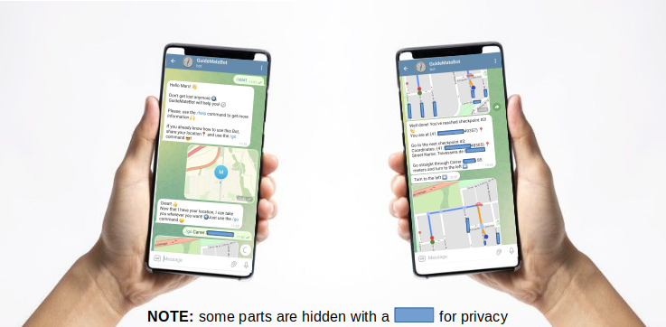
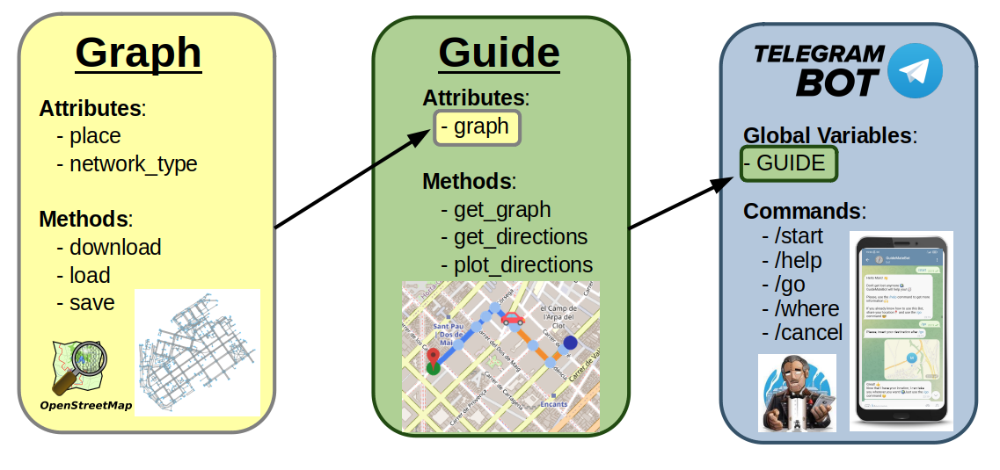
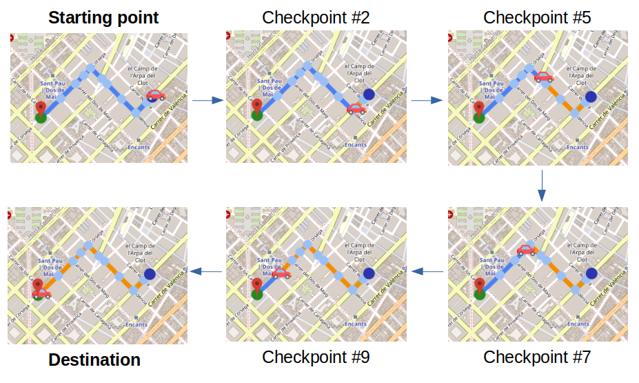
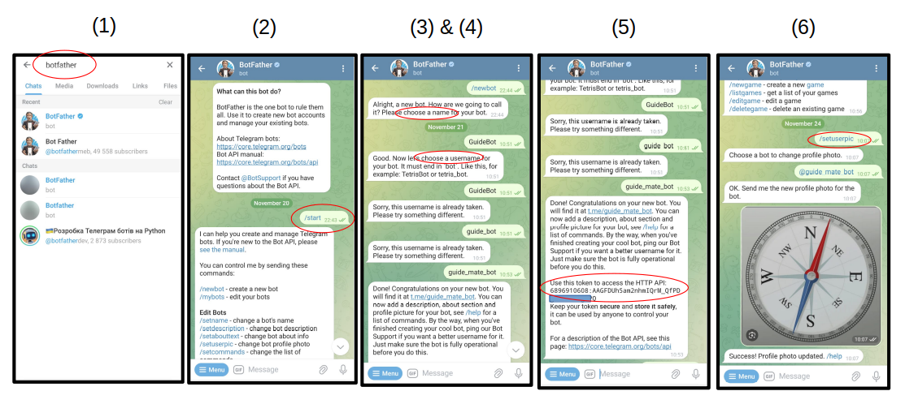

# GPS Telegram Bot
Implementation of a **GPS Telegram Bot** using **Python** [*telegram-api-bot, OpenStreetMap, NetworkX*]

# Introduction
Welcome to this friendly guide to building a **GPS-based Telegram bot**! At its core, this Bot serves as a user-friendly GPS assistant on the Telegram platform. It empowers users to effortlessly navigate from one point to another within their current cities, all while maintaining a warm and conversational interaction. 

This project also serves as a **tutorial**, guiding aspiring developers in the art of creating their very own GPS bots :)



# Project Structure

- [```README.md```](README.md): This file, providing an overview of the project.
- [```config/config.yml```](./config/config.yml): Configuration file to set the plotting parameters: colors, icons, etc.
- [```icons/```](./icons): Contains the icons (images) displayed in the maps to highlight relevant locations.
- [```images/```](./images): Contains the images used in this README file.
- [```LICENSE```](./LICENSE): The project's license information (Apache-2.0 License).
- [```requirements.txt```](./requirements.txt): Contains the list of Python libraries (and their versions) needed to work on this project.
- [```token.txt```](./token.txt): Your Bot's token (created by the **BotFather**).
- [```route_images/```](./route_images): Contains the images that describe each route. These images are sent to the user.
- [```saved_graphs/```](./saved_graphs): OpenStreetMap graphs that are saved to be loaded when needed (instead of downloaded every time).
- [```src/```](./src): Contains the Python code. The three main modules are explained below.



## [Graph Module](./src/graph.py)
This module defines a ```Graph``` class for working with street network graphs using the ```osmnx``` library (**OpenStreetMaps**). It allows to download, save, and load OpenStreet Maps of different cities.

## [Guide Module](./src/guide.py)
This module computes the shortest route between two points in the same city and displays the route on a map. The route is split into **legs** which are represented as a dictionary with the following format: (a **route** is represented as a sequence of **legs**)
```
leg_i = {
   'src': ...  # (lat, long) coordinates of the source point of this leg (checkpoint {i}-th)
   'mid': ...  # (lat, long) coordinates of the mid point of this leg (checkpoint {i+1}-th)
   'dst': ...  # (lat, long) coordinates of the destination point of this leg (checkpoint {i+2}-th)
   'current_name': ...  # street name of segment between src and mid
   'next_name': ...  # street name of segment between mid and dst
   'angle':  ...  # angle (in degrees) formed by the intersection of the segments src-mid and mid-dst
}
```
The colors and line widths of the map can be customized through the ```config/config.yml``` file.
Here is an example of the different **legs** (segments from one checkpoint to the next one) of a route in the city of Barcelona (Spain).



## [Bot Module](./src/main_bot.py)
This module uses the Telegram API to serve as a GPS Telegram Bot that will guide you wherever you want. This module uses a [Guide](./src/guide.py) instance to compute routes between points. It preprocesses the route to create meaningful messages that will guide users to their final destination. The messages are sent depending on the users' location in real-time.

# How to create a Telegram Bot
1) Search for the **@Botfather** in your Telegram app
2) Start a conversation (```/start```) and type the command ```/newbot```
3) Enter the new bot’s name (e.g. ```GuideMateBot```)
4) Enter bot’s username (must end with ```_bot```) (e.g. ```guide_mate_bot```)
5) Get bot’s API Token, and save it in a ```token.txt``` file. Then, we will use this token to initialize your bot using Python.
6) **[OPTIONAL]** Change the profile photo of your Bot.


   

# How to interact with the Bot
1) Type the ```/start``` command to start the conversation.
2) Type the ```/help``` command to know what can you do with this Bot.
3) **Share your location** with the Bot. If done correctly, you will receive a confirmation message.
4) Type the ```/where``` command to know where you are: city, street name, etc.
   - If you call the ```where``` command without sharing your location, the Bot will ask you to share your location first.
5) Type the ```/go``` command, followed by the destination you want to reach (like ```/go <street_name>, <num>```).
   - You don't have to specify the city since the Bot already knows it from the location you are sharing.
   - If you call the ```/go``` command without any destination (empty destination), the Bot will ask you to enter a destination.
   - If you call the ```/go``` command without sharing your location, the Bot will ask you to share your location first.
   - If you call the ```/go``` command with an unreachable destination, the Bot will ask you to try another one.

6) Type the ```/cancel``` command to cancel your ongoing route.
   - If you don't have any ongoing route, the Bot will let you know it.
7) If the Bot detects that you are moving away from the route, the Bot will send you a warning message.

# Getting started 
First, please make sure you have [Python](https://www.python.org/downloads/) installed.

Before installing the **Python libraries** used in this project, you may want to create a **Python Virtual Environment** ([venv](https://www.python.org/downloads/)), to avoid problems if you are working on other projects as well.

The Python Libraries used in this project are listed in the ```requirements.txt``` file. There you will find the Python libraries and their versions. You may use a package manager called ```pip``` to install them. If ```pip``` is not installed, you need to install it. If you have Python 3.4 or newer, pip should come pre-installed.

Enter your project directory:
```
cd <YOUR_PROJECT_DIR>
```

Clone the repository:
```
git clone https://github.com/marcpaulo15/GPS_TelegramBot.git
```

Create and activate your **Python Virtual Environment**. Then run the following command to install the libraries listed in your requirements.txt file:
```
pip install -r requirements.txt
```

To activate the Bot, run the following command in your project directory:
```
python3 src/main_bot.py
```

Then, you can interact with your Bot through the Telegram App (mobile or desktop)

# Dependencies

### [Haversine](https://pypi.org/project/haversine/)
The **Haversine** library is a Python package designed to **calculate the distance between two points on the Earth** given their latitude and longitude. The library is handy for applications that involve geospatial calculations, such as determining distances between locations. It uses the [**haversine formula**](https://en.wikipedia.org/wiki/Haversine_formula) to compute distances. The library supports various units for distance measurement, such as kilometers, miles, nautical miles, and meters.

### [NetworkX](https://networkx.org/documentation/stable/)
The **NetworkX** library is a powerful Python package for the creation, manipulation, and study of the structure, dynamics, and functions of complex networks (a.k.a. graphs). Networks, in this context, are mathematical representations of relationships between a set of objects, and they are widely used in various fields such as social network analysis, biological network analysis, transportation networks, and more.

The library includes **a wide range of algorithms for analyzing graphs**, including algorithms for finding paths, clustering coefficients, centrality measures, and community detection. It also allows for the visualization of graphs, providing tools to create clear and informative visual representations of network structures.


### [OSMnx](https://osmnx.readthedocs.io/en/stable/)
**OSMnx** is a Python library for **retrieving, modeling, analyzing, and visualizing street networks from [OpenStreetMap (OSM)](https://www.openstreetmap.org/#map=19/41.38657/2.09301&layers=G)** data. It simplifies the process of working with spatial and network data related to urban planning, transportation, and geography. This library allows users to download and construct street networks from OpenStreetMap data by specifying a bounding box or by providing other location information. The library provides **a NetworkX graph representation of the street network**, making it compatible with various network analysis tools (like the ```NetworkX`` library)

### [StaticMap](https://github.com/komoot/staticmap)
A small, python-based library for **creating map images with lines and markers**.
StaticMap is open source and licensed under Apache License, Version 2.0.

### [GeoPy](https://geopy.readthedocs.io/en/stable/)
The GeoPy library is a Python client for several popular **geocoding web services**. Geocoding is the process of converting addresses (like "1600 Amphitheatre Parkway, Mountain View, CA") into geographic coordinates (like latitude 37.423021 and longitude -122.083739), which can then be used for mapping or other location-based applications.

### [Telegram-Api-Bot](https://docs.python-telegram-bot.org/en/v20.6/)
For **interacting with the Telegram API in Python**, the python-telegram-bot library is commonly used. This library provides a convenient interface for working with the Telegram Bot API, allowing you to create and manage Telegram bots. The library facilitates the creation of Telegram bots, allowing developers to handle messages,and process commands and updates. The library supports sending and receiving files, location, photos, videos, and other media types.

### [PyYAML](https://pyyaml.org/wiki/PyYAMLDocumentation)
*"Yet Another Markup Language"* (**YAML**) is a human-readable data serialization format. **It's often used for configuration files**, data exchange between languages with different data structures, and in various applications where data needs to be stored, transmitted, or configured in a human-readable format. YAML's design aims to be simple and easy for both humans to read and write and for machines to parse and generate.

# Privacy
This Bot does not store the personal information of the user and does not track the location of the user. 

Every piece of information collected while the Bot is running is intended to be used just to make the bot work properly, not to leave the local environment and be used for other purposes outside the scope of this project.

# Contribute
Contributions to this project are welcome! If you'd like to improve the game, fix bugs, or add new features, feel free to fork the repository and submit a pull request.


# License
This project is licensed under the Apache-2.0 License. See the [LICENSE file](./LICENSE) for details.

# Hope you enjoyed it! Thanks! :)
